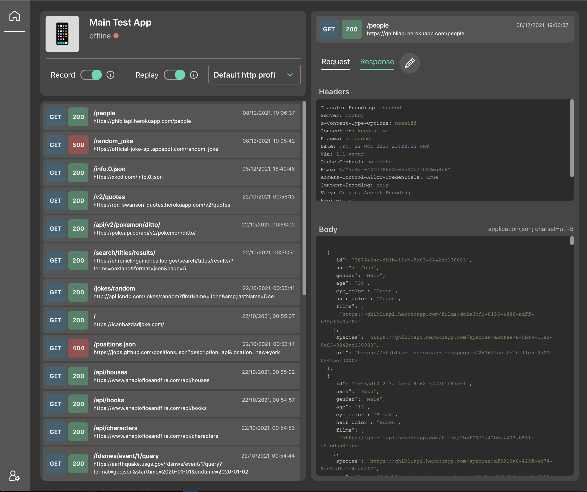
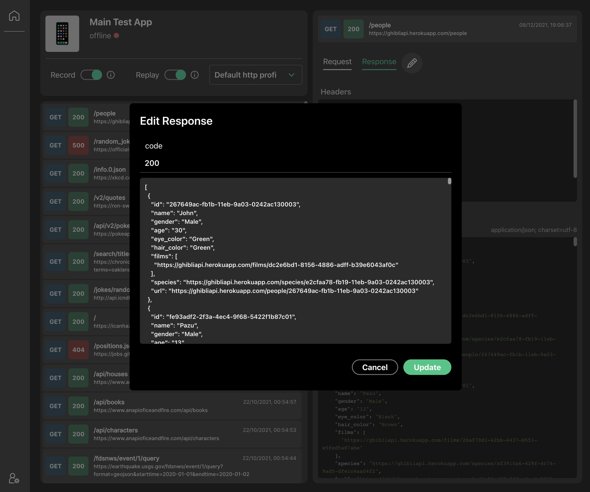
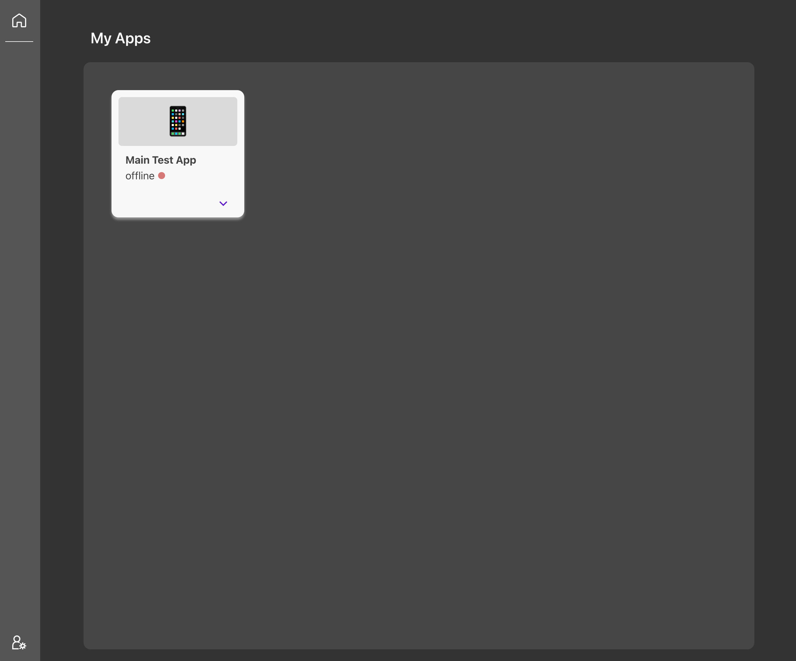
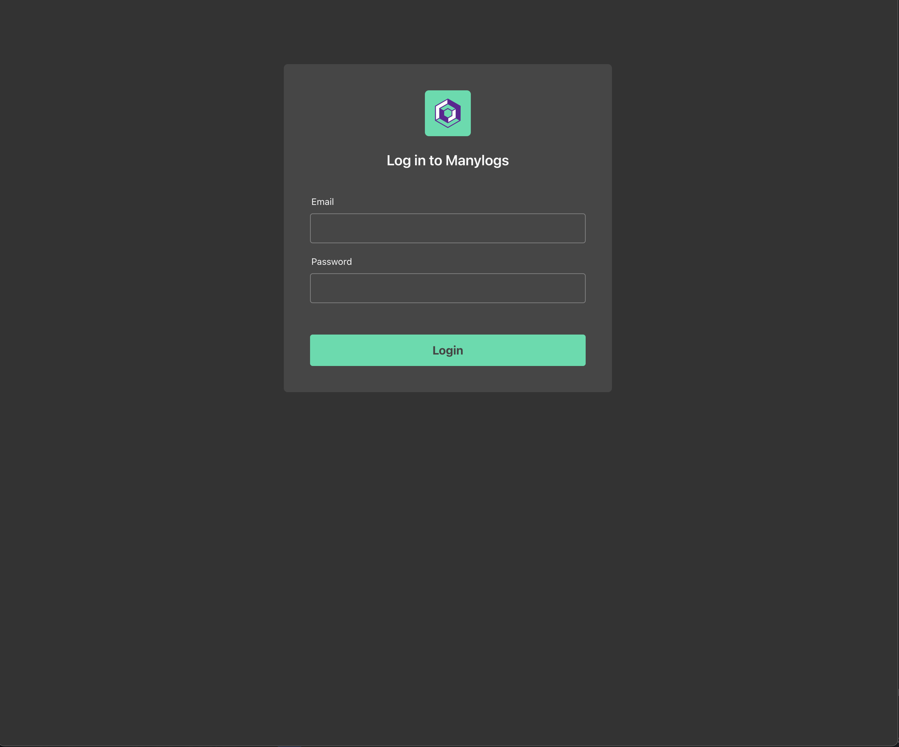

# [Manylogs](https://www.manylogs.com/) (web app)

Built with 🛠

- [ReactJS](https://reactjs.org/)
- [Grommet](https://github.com/grommet/grommet)

### About

Manylogs is a tool i developed for mobile developers to easily intercept and modify api calls during runtime. Project is no longer active.

